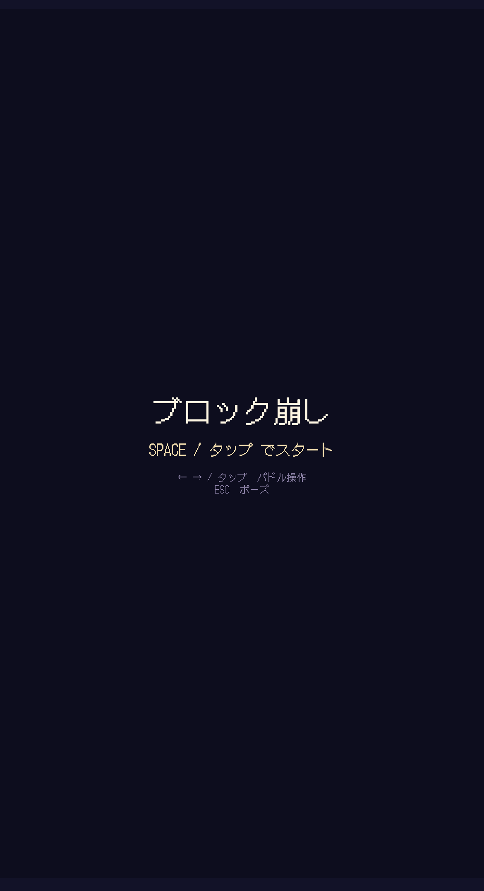
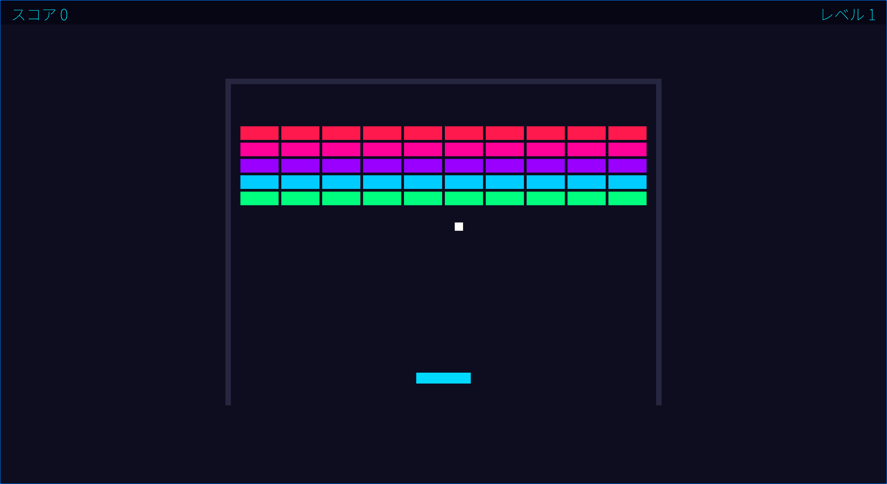

# ブロック崩し

Rust + Bevy 0.15 で作成したファミコン風ブロック崩しゲーム。




## 技術スタック

- **言語**: Rust (edition 2021)
- **ゲームエンジン**: Bevy 0.15
- **アーキテクチャ**: ECS (Entity Component System)
- **フォント**: DotGothic16 (ピクセルフォント、Google Fonts)
- **ビジュアル**: ファミコン風レトロカラーパレット、ピクセルパーフェクト描画

## ビルド・実行

```bash
cargo build
cargo run
```

- 初回ビルドには約 3GB 以上のディスク空き容量が必要
- Rust 未インストールの場合:
  ```bash
  curl --proto '=https' --tlsv1.2 -sSf https://sh.rustup.rs | sh
  ```

## WASM ビルド (ブラウザで遊ぶ)

```bash
# 事前準備 (初回のみ)
rustup target add wasm32-unknown-unknown
cargo install trunk

# 開発サーバー起動 (localhost:8080)
trunk serve

# 本番ビルド (dist/ に出力)
trunk build --release
```

WASM 版にはピクセルアート風のローディング画面が付属しています。

## 操作方法

| キー        | 操作                                 |
| ----------- | ------------------------------------ |
| SPACE       | ゲーム開始 / リトライ / 次のレベルへ |
| ← → / A D  | パドル移動                           |
| タッチ      | パドル移動 / 状態遷移                |
| ESC         | 一時停止 / 再開                      |

## ゲーム仕様

- **ブロック**: 5 行 x 10 列 (50 個)、行ごとにファミコン風カラーで色分け (コーラル / オレンジ / イエロー / グリーン / ブルー)
- **スコア**: ブロック破壊で 10 点
- **レベル**: 全ブロック破壊でクリア、次レベルではボール速度が 10% 増加
- **衝突**: AABB 判定、パドルの当たり位置でボール反射角度が変化
- **サウンド**: `assets/sounds/` に WAV ファイルを配置（無くても動作可）

## プロジェクト構造

```
src/
├── main.rs           # エントリーポイント、App設定・システム登録
├── components.rs     # ECSコンポーネント (Paddle, Ball, Block, Wall, Collider等)
├── resources.rs      # リソース (Score, Level, GameSounds)
├── constants.rs      # ゲーム定数 (画面サイズ、速度、ブロック配置等)
├── states.rs         # ゲーム状態Enum (Menu, Playing, Paused, GameOver, LevelClear)
└── systems/
    ├── mod.rs        # システムモジュールの公開
    ├── setup.rs      # 初期化 (カメラ、パドル、ボール、ブロック、壁、UI生成)
    ├── input.rs      # 入力処理 (パドル移動、ゲーム開始、一時停止)
    ├── movement.rs   # ボール移動
    ├── collision.rs  # 衝突検出 (パドル/壁/ブロック、勝利判定)
    ├── scoring.rs    # スコア・レベル表示更新
    ├── audio.rs      # サウンド再生 (CollisionEvent)
    └── game_state.rs # 状態管理 (メニュー/ゲームオーバー/レベルクリア画面)
index.html            # WASM用HTML (ローディング画面付き)
assets/
├── fonts/
│   └── DotGothic16-Regular.ttf  # ピクセルフォント (日本語対応)
└── sounds/
    ├── bounce.wav    # バウンド音
    ├── break.wav     # ブロック破壊音
    ├── gameover.wav  # ゲームオーバー音
    └── levelup.wav   # レベルアップ音
```

## ライセンス

フォント (DotGothic16) は [SIL Open Font License](https://scripts.sil.org/OFL) の下で配布されています。
